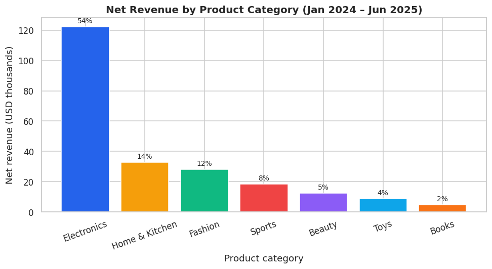
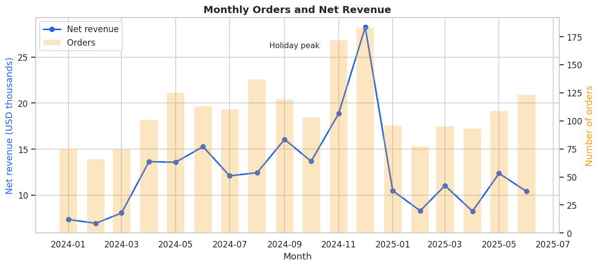
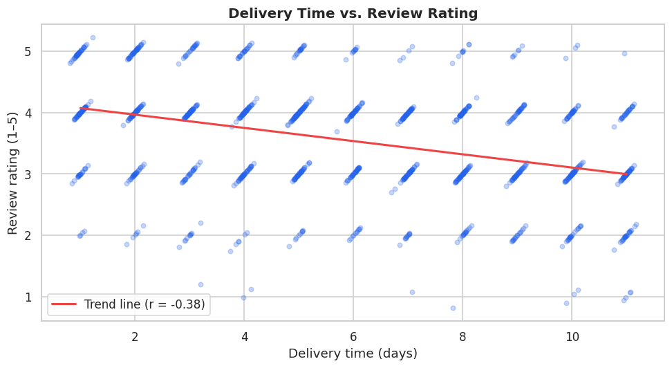
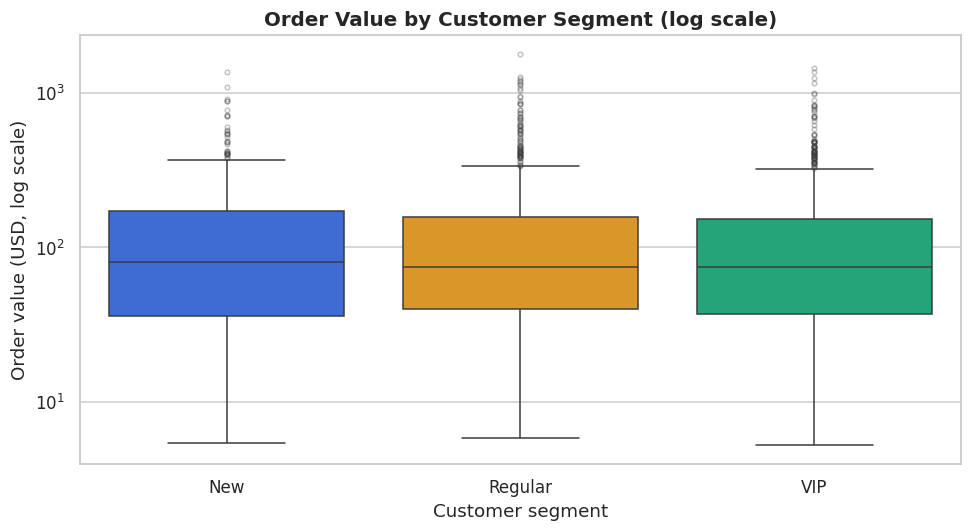

# E-commerce Customer Analytics

> An end-to-end data analytics project using **Python & Pandas** to clean, explore, analyse and visualise 18 months of e-commerce order data, and to turn the results into evidence-based business recommendations.

  

---

## 1. Problem statement & scope

An online retailer selling across seven Southeast-Asian markets has grown quickly but has never analysed its order history systematically. Management does not know **which products, customer groups and markets drive revenue**, **whether customers come back after their first purchase**, or **why some customers leave poor reviews and return products**.

**In scope:** order-level transactions from 1 Jan 2024 – 30 Jun 2025 (2,045 raw rows / 1,972 after cleaning), customer attributes (age, gender, country, segment, channel), order attributes (category, price, discount, payment, device, delivery time, status, rating), data cleaning, descriptive & statistical analysis, and visualisation.

**Out of scope:** SKU-level analysis, cost/margin data, predictive modelling, web-analytics events.

## 2. Objectives & analytical questions

| # | Objective | Success measure |
|---|-----------|-----------------|
| O1 | Identify the main revenue drivers | Revenue share per category / segment / country / channel; groups producing ≥ 80 % of revenue |
| O2 | Measure retention and value concentration | Repeat-purchase rate, revenue share of top 20 % customers, churn-risk share |
| O3 | Diagnose service-quality problems | Correlation of delivery time with rating; return rate per category |

**Analytical questions**

1. Which product categories generate the most revenue, and which have the highest return rates?
2. How do customer segments (New / Regular / VIP) differ in order frequency, order value and total spend?
3. How do orders and revenue trend month by month — is there seasonality?
4. Which countries and acquisition channels bring the most valuable customers?
5. Does delivery time affect the review rating customers give?
6. What share of customers are repeat buyers, and how many are at risk of churning?
7. Do device usage and payment preferences differ across age groups?

## 3. Project structure

```
ecommerce-customer-analytics/
├── data/
│   ├── raw/ecommerce_orders_raw.csv          # 2,045 rows, includes deliberate quality issues
│   └── processed/ecommerce_orders_clean.csv  # 1,972 rows × 31 columns after cleaning
├── notebooks/
│   └── ecommerce_customer_analytics.ipynb    # main analysis (executed, with outputs)
├── src/
│   ├── generate_dataset.py                   # reproducible synthetic data generator
│   └── data_cleaning.py                      # reusable cleaning pipeline + customer table
├── outputs/
│   └── figures/                              # 9 charts exported from the notebook
├── docs/
│   ├── data_dictionary.md                    # field-by-field data dictionary
│   ├── project_report.docx                   # written report
│   └── presentation.pptx                     # slides for the live demo
├── README.md
├── requirements.txt
└── .gitignore
```

## 4. Dataset

The dataset is **synthetic but realistic**: `src/generate_dataset.py` simulates 2,000 orders from ~720 customers with seasonal demand, segment-dependent purchase frequency, category-dependent prices and return rates, and a delivery-time → rating relationship. It then deliberately injects **missing values, 45 duplicate rows, 25 out-of-range values and inconsistent category spelling** so the cleaning steps have realistic work to do. Regenerate it with `python src/generate_dataset.py` (seed 42 → identical file).

Full field descriptions: [`docs/data_dictionary.md`](docs/data_dictionary.md).

## 5. How to run

```bash
# 1. Clone and install
git clone https://github.com/<your-username>/ecommerce-customer-analytics.git
cd ecommerce-customer-analytics
python -m venv .venv && source .venv/bin/activate   # Windows: .venv\Scripts\activate
pip install -r requirements.txt

# 2. (Optional) regenerate the raw dataset and run the cleaning pipeline from the CLI
python src/generate_dataset.py
python src/data_cleaning.py

# 3. Open the notebook
jupyter notebook notebooks/ecommerce_customer_analytics.ipynb
```

The notebook runs top-to-bottom in ~15 seconds (`Kernel → Restart & Run All`) and writes the charts to `outputs/figures/`.

## 6. Methodology (mapped to the notebook sections)

| Step | Notebook section | What is done |
|------|------------------|--------------|
| Load & explore | §5 | `head`, `shape`, `columns`, `info`, `describe` |
| Missing values | §6 | `isnull()` audit; median (age), mode (payment), mode-within-country (city), row removal (price); structural NaNs kept |
| Duplicates | §7 | 45 exact duplicates removed → 2,000 rows |
| Validation | §8 | Type checks, category domains, numeric range rules (age 18–100, rating 1–5, discount 0–100 …), logical rule order ≥ sign-up; 28 rows dropped → 1,972 rows |
| Derived columns | §9 | `total_amount`, `net_revenue`, `customer_tenure_days`, `age_group`, `order_value_tier`, flags … (11 columns) |
| Pandas analysis | §10 | filtering, sorting, `groupby`/`agg`, `pivot_table`, `crosstab`, customer-level RFM table |
| Statistics | §11 | mean/median/mode/min/max/std/var, skewness, correlation matrix, t-test, chi-square, ANOVA |
| Visualisation | §12 | 9 charts (bar, line, histogram, pie, scatter, box, grouped bar, heatmap, stacked bar), each with interpretation |
| Findings | §13 | 7 findings, 7 recommendations, limitations |

## 7. Key findings

1. **Revenue is concentrated in Electronics** — 54 % of net revenue from 24 % of orders; Electronics + Home & Kitchen + Fashion ≈ 80 %.
2. **VIP customers drive value through frequency** — 23 % of customers, 40 % of revenue, 4.8 orders each vs 1.6 for New; order value per order is *not* significantly different (p = 0.60).
3. **Slow delivery hurts ratings** — 3.96 ★ for 1–3-day delivery vs 3.02 ★ for 10+ days; r = −0.38, p < 0.001.
4. **17 % of orders produce no revenue** — 10.8 % returned + 6.6 % cancelled; Fashion has the highest return rate (13.6 %).
5. **Strong year-end seasonality** — December 2024 ≈ 2.4× the Q1 monthly average; January revenue −63 % month-on-month.
6. **Good retention, but many dormant customers** — 67 % repeat rate, top 20 % of customers = 57 % of revenue, yet 45 % inactive > 180 days.
7. **Referral brings the least valuable customers** ($237 per customer vs $325 for Email).

## 8. Recommendations

1. Set a ≤ 5-day delivery SLA in the top three markets and show delivery estimates at checkout.
2. Launch a second-purchase voucher programme for New customers and a win-back campaign for the 45 % dormant customers.
3. Cut Fashion / Sports returns with size guides, fit reviews and return-reason tracking.
4. Diversify revenue with cross-sell bundles and Beauty promotions in high-AOV markets.
5. Plan inventory & ad budget around the Nov–Dec peak and run a January promotion to soften the trough.
6. Rebalance acquisition spend from Referral toward Email / Social; pay referral rewards only after the second order.
7. Cap VIP discounts at ~10 % and replace with non-price perks such as free express shipping.

## 9. Sample visualisations

| | |
|---|---|
|  |  |
|  |  |

## 10. Live demo script (≈ 8 minutes)

1. Show the repo structure and `README` (1 min).
2. Run `python src/generate_dataset.py` → show `df.describe()` revealing the bad values (1 min).
3. Walk through notebook §6–§8: missing values, duplicates, validation report (2 min).
4. Show 2–3 analysis tables (category, segment, delivery vs rating) (2 min).
5. Show the charts and the findings / recommendations table (2 min).

## Author

**Sak** — E-commerce Customer Analytics project, 2026.
